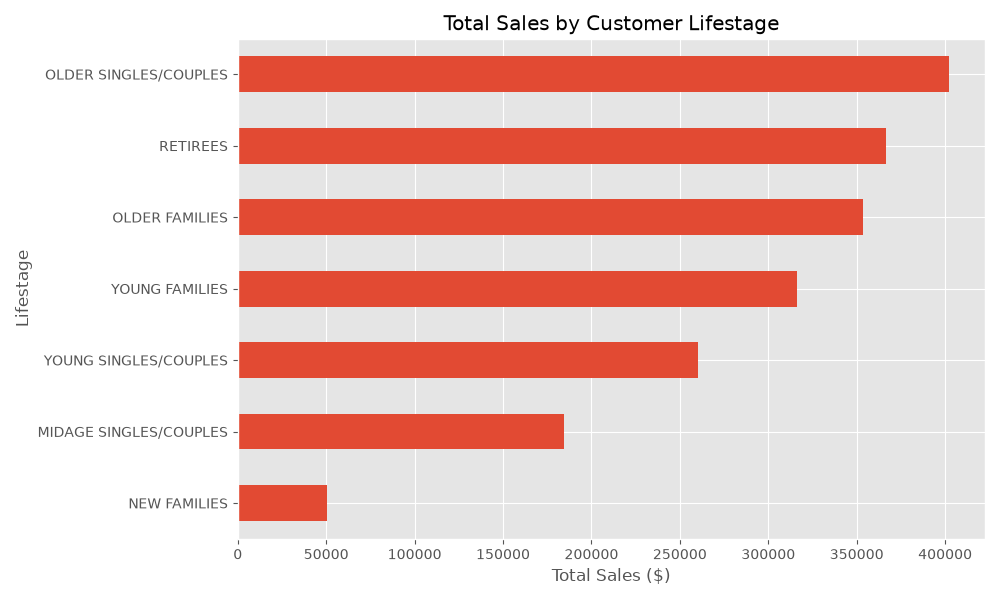
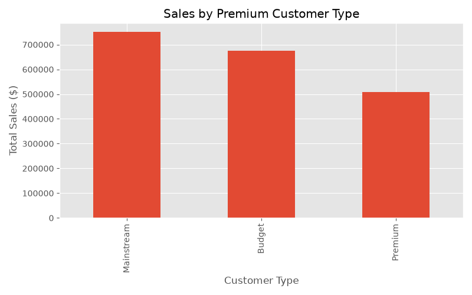
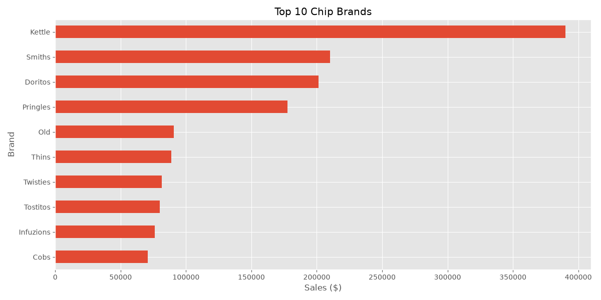
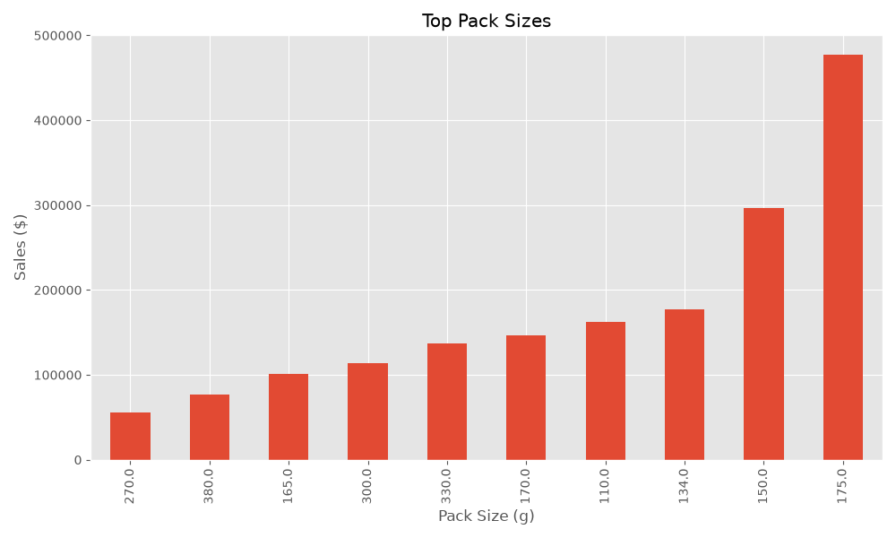

# 🛒 Quantium Task 1 - Customer Analytics using Python

## 📌 Project Overview

This project is based on the **Quantium Data Analytics Virtual Experience Program** offered through Forage.

The objective of this project is to analyze retail transaction and customer purchase behaviour data to understand customer segments and their purchasing patterns. The insights generated from this analysis can help the Category Manager make better business decisions for the chips category.

---

## 🎯 Business Problem

Quantium's Category Manager wants to understand:

- Who are the major chip customers?
- Which customer segments generate the highest sales?
- Which brands perform the best?
- Which pack sizes are the most popular?
- How can marketing strategies improve future sales?

---

## 📂 Dataset

The project uses two datasets:

1. **QVI_transaction_data.xlsx**
   - Customer transactions
   - Product information
   - Sales
   - Quantity
   - Date

2. **QVI_purchase_behaviour.csv**
   - Customer Lifestage
   - Premium Customer Segment

---

## 🛠️ Tools & Technologies

- Python
- Pandas
- NumPy
- Matplotlib
- OpenPyXL
- VS Code
- Git
- GitHub

---

## 📊 Project Workflow

### 1. Data Loading

- Import transaction data
- Import customer data

### 2. Data Cleaning

- Missing value check
- Duplicate check
- Data type conversion
- Invalid records inspection

### 3. Feature Engineering

- Extract Brand Name
- Extract Pack Size

### 4. Data Merging

Merge transaction data with customer purchase behaviour.

### 5. Customer Analytics

Analyze:

- Total Sales
- Customer Segments
- Premium Customers
- Top Brands
- Pack Size Performance

### 6. Data Visualization

Created charts for:

- Sales by Lifestage
- Sales by Premium Customer
- Top 10 Brands
- Top Pack Sizes

### 7. Business Recommendations

Provide data-driven recommendations for the Category Manager.

---

## 📁 Project Structure

```
quantium-task1-customer-analytics

│
├── data
│   ├── raw
│   └── processed
│
├── src
│   └── Task1_Data_Preparation_Customer_Analytics.py
│
├── output
│   ├── charts
│   └── report
│
└── README.md
```

---

## 📈 Key Insights

- Customer purchasing behaviour varies across different lifestages.
- Premium customers contribute significantly to overall sales.
- Certain chip brands outperform competitors.
- Some pack sizes are consistently more popular than others.

---

## 💡 Business Recommendations

- Focus marketing campaigns on high-value customer segments.
- Increase inventory for popular brands.
- Optimize shelf space for high-performing pack sizes.
- Create personalized promotions for premium customers.
- Improve marketing strategies using customer segmentation.

---

## ▶️ How to Run

Clone this repository

```bash
git clone https://github.com/syed-ubedullah/quantium-task1-customer-analytics.git
```

Install required libraries

```bash
pip install -r requirements.txt
```

Run the project

```bash
python src/Task1_Data_Preparation_Customer_Analytics.py
```


---

# 📷 Project Visualizations

## Sales by Lifestage



---

## Sales by Premium Customer



---

## Top 10 Brands



---

## Top Pack Sizes



---

## 👨‍💻 Author

**Syed Ubedullah Basha**

Aspiring Data Analyst

GitHub:
https://github.com/syed-ubedullah

LinkedIn:
(Add your LinkedIn profile here)

---

## ⭐ Acknowledgement

This project was completed as part of the **Quantium Data Analytics Virtual Experience Program** on Forage.